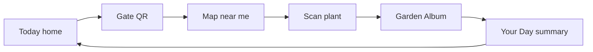

# Fairchild App — Complete Audit Report (Print Edition)

**Project:** fairchild-next (Fairchild Tropical Botanic Garden)  
**Repository:** `fairchild-next CURSOR`  
**Commit reviewed:** `b54208a` (May 4, 2026) — synced with `origin/main`  
**Audit date:** June 4, 2026  
**Type:** Read-only review — no application code was changed during auditing  

This document compiles the full audit sequence from technical/safety through UX/UI, critical UX addendum, product obsession analysis, and the magical product blueprint — **as delivered in the Cursor audit session**, in order.

---

## Table of Contents

1. [Production Readiness Audit (Technical & Safety)](#fairchild-app--production-readiness-audit-technical--safety)
2. [Supplemental Technical & Safety Audits](#supplemental-technical--safety-audits)
3. [UX/UI Design Audit](#fairchild-app--uxui-design-audit)
4. [UX Critical Addendum](#ux-critical-addendum)
5. [CTO Panel: Obsession & Product Experience](#would-users-become-obsessed-with-fairchild)
6. [Magical Product Blueprint (Buildable)](#making-fairchild-magical--realistic-product-blueprint)

---

# Fairchild App — Production Readiness Audit (Technical & Safety)

**Scope:** Read-only review of `/Users/kelseysiegel/Desktop/fairchild-next CURSOR` (synced with `origin/main`, commit `b54208a`, May 4, 2026). **No code was changed.**

**Stack note:** Your prompt references Next.js 14; this repo runs **Next.js 16.1.6** with React 19 and App Router.

---

## Executive Summary

This is a capable **single-tenant MVP** with real commerce, auth, staff tools, and multiple product modes—but it is **not** production-hardened for enterprise due diligence, white-label resale, or high-trust payment/security review. The Stripe webhook correctly verifies signatures, and staff APIs generally enforce `requireStaff`, but **Row Level Security on commerce tables is dangerously permissive** (any authenticated client can insert/update orders and tickets). Checkout **trusts client-supplied prices**, and several API routes (`verify-order`, `resolve-url`) are exploitable without authentication. Multi-tenancy is **documentation-only**; Fairchild branding and coordinates are hard-coded across ~90+ files. PWA exists but **does not cache tickets/QR for offline gate use**. There is **no Sentry, no CI, no rate limiting**, and **no staging discipline** encoded in the repo. For a **Fairchild-only Phase 1 pilot with named security fixes**, cautious launch is conceivable; for **real money at scale, second-garden sales, or IT/security sign-off**, critical blockers must be resolved first.

---

## Direct Answers (Required Call-Outs)

| Question | Answer |
|----------|--------|
| **Safe to process real money right now?** | **No — not without fixes.** Webhook signature validation is correct, but client-controlled prices, permissive RLS, and weak idempotency create fraud and data-integrity risk. |
| **Can any user access another user's data?** | **Partially mitigated via APIs** (`my-tickets` scopes by `user_id`), but **direct Supabase client access** could allow ticket/order manipulation; `order_items` are readable by all authenticated users per RLS. |
| **Client 2 tomorrow?** | **Separate Vercel + Supabase + Stripe deploy** is the only realistic path today (~12+ manual steps). Single codebase multi-tenant would break without schema + config refactor. |
| **Single most dangerous vulnerability** | **Permissive RLS on `orders`, `order_items`, `tickets`, `visits`** combined with **client-trusted checkout prices**. |
| **Stripe / Vercel / Supabase would flag immediately** | Price manipulation server-side gap; RLS `using (true)` / `with check (true)` on commerce writes; unauthenticated `verify-order`; service role used broadly; webhook returns 200 on ticket insert failure. |
| **QR camera cleanup on unmount?** | **Staff scanner: yes** (`getTracks().stop()`). **LearnScanner: partial** — stops ZXing controls but does **not** call `getTracks().stop()` on the underlying stream (privacy/memory risk). |
| **Supabase tables with no RLS publicly readable?** | **`kids_badges` has no RLS enabled.** Commerce tables have RLS but policies are effectively open for writes. Map/plants/events are intentionally public read. |
| **Nonprofit IT approval blockers?** | Permissive RLS, no error monitoring, no CI, PWA ticket offline gap, visitor-facing staff instructions, limited WCAG evidence, no `.env.example`, manual migrations. |

---

## RLS Table Inventory

| Table | RLS | Policy summary | Risk |
|-------|-----|----------------|------|
| `ticket_types` | ✅ | Public SELECT | Low (catalog) |
| `time_slots` | ✅ | Public SELECT | Low |
| `orders` | ✅ | INSERT/UPDATE **anyone**; SELECT own | **Critical** |
| `order_items` | ✅ | INSERT **anyone**; SELECT **all rows** | **Critical** |
| `tickets` | ✅ | INSERT/UPDATE **anyone**; SELECT own | **Critical** |
| `visits` | ✅ | INSERT **anyone**; SELECT own | **High** |
| `events` | ✅ | Public SELECT | Low |
| `members` | ✅ | SELECT own only | Medium (no user INSERT — good) |
| `staff` | ✅ | SELECT own | Low |
| `map_*` | ✅ | Public read; staff write (later migration) | Low read / staff write OK |
| `plants` | ✅ | Public SELECT | Low |
| `garden_status` | ✅ | Public SELECT | Low |
| `kids_discoveries` | ✅ | Own rows | Low |
| `kids_badges` | ❌ **Not enabled** | Default grants apply | **High** |
| `kids_user_badges` | ✅ | Own rows | Low |
| `wedding_*` | ✅ | Couple + staff scoped | Medium (column-level notes in API) |
| `location_events` | ✅ | INSERT **anyone**; SELECT own | Medium |

---

## Issues (Structured)

### CRITICAL — Commerce RLS allows arbitrary writes

**ISSUE:** Permissive RLS on orders, tickets, order_items, visits  
**SEVERITY:** Critical  
**CATEGORY:** Security  
**FILE(S):** `supabase/migrations/20250302000000_seed_ticket_schema.sql`  
**CODE:**
```119:136:supabase/migrations/20250302000000_seed_ticket_schema.sql
create policy "orders_insert" on orders for insert with check (true);
create policy "orders_update" on orders for update using (true);
create policy "order_items_insert" on order_items for insert with check (true);
create policy "order_items_select" on order_items for select using (true);
create policy "tickets_insert" on tickets for insert with check (true);
create policy "tickets_update" on tickets for update using (true);
```
**PROBLEM:** Any user with the anon key and a valid session (or possibly anonymous insert, depending on grants) can mutate commerce data outside your API.  
**IMPACT:** Ticket fraud, free tickets, marking others’ tickets used, order tampering.  
**SCENARIO:** A technical visitor uses browser DevTools + Supabase JS to `update tickets set status='used'` for QR codes they photographed.  
**FIX:** Restrict INSERT/UPDATE to service role or security-definer RPCs; tighten SELECT on `order_items` to order owner; add policies tying writes to `auth.uid()` and order ownership.

---

### CRITICAL — Client-controlled Stripe prices

**ISSUE:** Checkout API trusts `item.price` from request body  
**SEVERITY:** Critical  
**CATEGORY:** Security / Stripe  
**FILE(S):** `src/app/api/checkout/route.ts`, `src/lib/commerce/providers/stripeProvider.ts`  
**CODE:**
```48:55:src/app/api/checkout/route.ts
    const orderItemsPayload = body.items.map((item: any) => ({
      order_id: order.id,
      ticket_type_id: item.productId ?? item.id,
      ...
      unit_price: Math.round(item.price * 100),
```
```15:24:src/lib/commerce/providers/stripeProvider.ts
    const line_items = items.map((item) => ({
      price_data: {
        ...
        unit_amount: Math.round(item.price * 100),
      },
      quantity: item.quantity,
    }));
```
**PROBLEM:** Attacker POSTs `price: 0.01` for adult admission.  
**IMPACT:** Revenue loss, Stripe/chargeback disputes, contract breach with garden.  
**SCENARIO:** Bunny Hoppening sellout; script buys 50 tickets at $0.01 each before staff notices.  
**FIX:** Server-side lookup of `ticket_types`, peak rules, `events` pricing; reject mismatches; validate `quantity` (1–N, integer, slot capacity).

---

### CRITICAL — Unauthenticated order status update via Stripe session ID

**ISSUE:** `/api/verify-order` has no auth  
**SEVERITY:** Critical  
**CATEGORY:** Security  
**FILE(S):** `src/app/api/verify-order/route.ts`  
**CODE:**
```15:38:src/app/api/verify-order/route.ts
export async function POST(req: Request) {
  const { sessionId } = await req.json();
  ...
  const session = await getStripe().checkout.sessions.retrieve(sessionId);
  if (session.payment_status !== "paid") {
    return NextResponse.json({ status: "failed" });
  }
  ...
    await supabase
      .from("orders")
      .update({ status: "paid" })
      .eq("id", orderId);
```
**PROBLEM:** Anyone with a paid `session_id` (visible in success URL) can mark DB orders paid outside webhook flow.  
**IMPACT:** State desync, duplicate ticket generation paths, audit confusion.  
**SCENARIO:** User shares success URL in group chat; third party triggers verify-order repeatedly.  
**FIX:** Require authenticated user matching order `user_id`; or remove endpoint and rely solely on webhook + idempotent recovery.

---

### HIGH — Unauthenticated SSRF via resolve-url

**ISSUE:** Server fetches arbitrary user URLs  
**SEVERITY:** High  
**CATEGORY:** Security  
**FILE(S):** `src/app/api/resolve-url/route.ts`, `src/components/LearnScanner.tsx`  
**PROBLEM:** No auth, no allowlist; internal network probing from Vercel egress.  
**IMPACT:** SSRF, metadata leakage, abuse costs.  
**SCENARIO:** Attacker loops requests to internal IPs or large files.  
**FIX:** Remove endpoint; resolve only known Fairchild URL patterns server-side, or allowlist hostnames.

---

### HIGH — No API rate limiting

**ISSUE:** Zero rate limits on checkout, scan, discoveries, resolve-url  
**SEVERITY:** High  
**CATEGORY:** Security  
**FILE(S):** All `src/app/api/**/route.ts`  
**IMPACT:** Brute force, checkout spam, webhook-adjacent DoS, Supabase connection exhaustion.  
**FIX:** Vercel middleware + Upstash, or Supabase edge rate limits on sensitive routes.

---

### HIGH — Webhook idempotency race + silent failures

**ISSUE:** Count-based dedup only; failures still return 200  
**SEVERITY:** High  
**CATEGORY:** Security / Stripe  
**FILE(S):** `src/app/api/webhooks/stripe/route.ts`  
**CODE:**
```53:67:src/app/api/webhooks/stripe/route.ts
    if (existingTicketCount && existingTicketCount > 0) {
      return NextResponse.json({ received: true });
    }
    if (!internalOrderId) {
      console.error("Missing order_id in Stripe metadata");
      return NextResponse.json({ received: true });
    }
```
**PROBLEM:** Concurrent webhooks can double-insert; ticket insert errors still acknowledge event.  
**IMPACT:** Paid but no tickets; duplicate tickets; Stripe stops retrying.  
**FIX:** `stripe_events` table with unique `event.id`; transactional ticket creation; return 500 on insert failure.

---

### HIGH — Donation amount unbounded server-side

**ISSUE:** Any positive `donation` becomes Stripe line item  
**SEVERITY:** High  
**CATEGORY:** Stripe  
**FILE(S):** `src/lib/commerce/providers/stripeProvider.ts`  
**PROBLEM:** No max, no preset allowlist; not stored on `orders` row.  
**FIX:** Allowlist amounts; cap (e.g. $500); persist on order for reporting.

---

### HIGH — No quantity / capacity validation at checkout

**ISSUE:** No server checks for `quantity <= 0`, slot capacity, or inventory  
**SEVERITY:** High  
**CATEGORY:** Security / Database  
**FILE(S):** `src/app/api/checkout/route.ts`  
**PROBLEM:** Overselling, negative quantities (Stripe may reject), no `capacity_remaining` decrement.  
**SCENARIO:** 1,000 users buy same 100-capacity slot during Bunny Hoppening.  
**FIX:** Transactional slot decrement; validate quantity bounds.

---

### HIGH — `kids_badges` table without RLS

**ISSUE:** Badge catalog not RLS-protected  
**SEVERITY:** High  
**CATEGORY:** Security / Kids Mode  
**FILE(S):** `supabase/migrations/20250317000000_kids_discoveries_badges.sql`  
**PROBLEM:** `kids_user_badges` has RLS; `kids_badges` does not — potential direct insert/manipulation depending on grants.  
**FIX:** Enable RLS; public read-only on catalog; writes via service role only.

---

### HIGH — PWA does not cache active tickets / QR offline

**ISSUE:** Service worker excludes `/api/`; tickets fetched live  
**SEVERITY:** High  
**CATEGORY:** PWA  
**FILE(S):** `public/sw.js`, `src/app/tickets/my/page.tsx`  
**PROBLEM:** Visitors in dead zones cannot show QR at gate.  
**FIX:** Cache ticket payload + QR in IndexedDB after purchase; offline UI state.

---

### HIGH — LearnScanner camera stream not fully stopped on unmount

**ISSUE:** Cleanup stops ZXing, not MediaStream tracks  
**SEVERITY:** High  
**CATEGORY:** Security / Performance  
**FILE(S):** `src/components/LearnScanner.tsx`  
**CODE:**
```159:165:src/components/LearnScanner.tsx
  useEffect(() => {
    return () => {
      controlsRef.current?.stop();
      controlsRef.current = null;
      codeReaderRef.current = null;
    };
  }, []);
```
**PROBLEM:** Camera LED stays on; battery drain; privacy concern.  
**FIX:** Mirror staff scanner: `srcObject` stream → `getTracks().forEach(t => t.stop())`.

---

### MEDIUM — Staff-facing copy on visitor routes

**ISSUE:** Internal workflow exposed to guests  
**SEVERITY:** Medium  
**CATEGORY:** Code Quality / Product  
**FILE(S):** `src/app/events/map/page.tsx`, `src/app/wedding/map/page.tsx`  
**CODE:**
```34:37:src/app/events/map/page.tsx
        <p className="text-sm text-[var(--text-muted)] mb-3">
          Explore the Garden. Pins and wayfinding for {bunnyHoppeningEvent.shortName} are edited in
          Staff → Map Editor → Events mode.
```
**FIX:** Replace with guest-facing copy; keep staff instructions in staff routes only.

---

### MEDIUM — Events map appears “blank” — data issue, not API key

**ISSUE:** `events` map_config exists but POIs likely empty until staff copies/edits  
**SEVERITY:** Medium  
**CATEGORY:** Events Mode / Database  
**FILE(S):** `supabase/migrations/20260324120000_map_mode_configs.sql`, `src/app/events/map/page.tsx`, `src/app/api/map/copy-from/route.ts`  
**PROBLEM:** Migration inserts config row only; no POI seed for `events` slug. Map renders empty basemap.  
**SCENARIO:** CFO opens Events Map during demo — looks unfinished.  
**FIX:** Run staff “copy from default” or seed event POIs; remove staff instructions from UI.

---

### MEDIUM — Wedding venue pages not SEO-indexable

**ISSUE:** All wedding routes are `"use client"` with no `generateMetadata`  
**SEVERITY:** Medium  
**CATEGORY:** Wedding Mode  
**FILE(S):** `src/app/wedding/venues/[slug]/page.tsx`  
**PROBLEM:** Google sees minimal content for “Fairchild wedding venue” queries.  
**FIX:** Server components + metadata per venue slug.

---

### MEDIUM — No error monitoring or payment alerting

**ISSUE:** No Sentry/Datadog; webhook failures only `console.error`  
**SEVERITY:** Medium  
**CATEGORY:** Monitoring  
**FILE(S):** `package.json` (no `@sentry`), `src/app/api/webhooks/stripe/route.ts`  
**IMPACT:** 2am checkout failures invisible until customer complaints.

---

### MEDIUM — No CI/CD or `.env.example`

**ISSUE:** No GitHub Actions; env vars undocumented in repo  
**SEVERITY:** Medium  
**CATEGORY:** Deployment  
**IMPACT:** Preview deploys may share prod credentials accidentally; inconsistent releases.

---

### MEDIUM — Member reserve trusts client catalog IDs/prices

**ISSUE:** `$0` check only; no DB price validation  
**SEVERITY:** Medium  
**CATEGORY:** Security  
**FILE(S):** `src/app/api/members/reserve/route.ts`  
**FIX:** Same server-side catalog validation as checkout.

---

### MEDIUM — Scan ticket race (no optimistic locking)

**ISSUE:** Two staff scanners can both pass `status !== 'used'`  
**SEVERITY:** Medium  
**CATEGORY:** Security  
**FILE(S):** `src/app/api/scan-ticket/route.ts`  
**FIX:** `update ... where status = 'unused' returning *`; single-row lock.

---

### MEDIUM — `my-tickets` admin fallback can generate tickets without payment proof

**ISSUE:** Service role generates tickets for any paid order matching email  
**SEVERITY:** Medium  
**CATEGORY:** Security  
**FILE(S):** `src/app/api/my-tickets/route.ts` (lines 57–134)  
**PROBLEM:** Useful recovery, but callable on every GET when user has zero tickets.  
**FIX:** Move to one-time staff tool or signed recovery token.

---

### LOW — `console.log` in webhook production path

**FILE(S):** `src/app/api/webhooks/stripe/route.ts` (lines 60, 69, 132)

---

### LOW — Single PWA icon (`window.svg`, `sizes: "any"`)

**FILE(S):** `public/manifest.json` — iOS home screen may look unprofessional.

---

### LOW — Duplicate `members` migration files

**FILE(S):** `20250304000000_members.sql`, `20250316000001_create_members_table.sql`

---

## Section Summaries (Categories 1–16)

### 1. Multi-Tenant Architecture Readiness — **~15/100**

- No `tenant_id` / `garden_id` in schema.
- ~27 files import `@/lib/clients/fairchild/*` directly; README describes future registry — **not built**.
- Routing: mode slugs (`kids`, `wedding`, `events`), not institution tenancy.
- Env model: **one deploy = one Supabase + one Stripe**.
- Feature flags: only `NEXT_PUBLIC_TICKET_REQUIRE_ACTIVATION`, `NEXT_PUBLIC_MEMBER_TICKET_MAX`.
- **Client 2 manual steps:** new Supabase project, run migrations (edit seeds), new Stripe, Vercel project, rebrand `layout.tsx`/`manifest.json`/SW, new `clients/<slug>/` modules, replace imports, new `public/` assets, re-seed map/tickets/plants, staff/member setup, update `api/today` coordinates.

### 2. Security — See issues above. Service role is **server-only** ✅.

### 3. Frontend Architecture

- App Router used consistently ✅.
- Heavy `"use client"` on marketing/wedding/events pages — hurts SEO and bundle.
- **Large components:** `MapEditor.tsx` (856 lines), `GardenMapLeaflet.tsx` (441).
- Mode switching via React contexts + localStorage (`fairchild-kids-mode`, etc.) — workable but not centralized feature config.
- Staff/couple layouts: client-side auth gates (flash of content before redirect).

### 4. Database Design

- FKs present on core commerce tables ✅.
- **Missing indexes:** `tickets.user_id`, `tickets.qr_code` (only `event_id` indexed).
- **No capacity decrement** on purchase → overselling risk.
- Timestamps: `timestamptz` ✅; slot dates as `date` + `time` — OK for Miami if TZ documented.
- `coordinator_notes` on wedding bookings — API must strip (noted in migration comments).
- PII: `customer_email`, wedding couple data — appropriate for product; needs retention policy.

### 5. Stripe Integration

- Webhook signature: ✅
- Donation: separate line item ✅ (good for reporting)
- Failure points: Vercel timeout on checkout (no retry UI), webhook silent 200 on errors, verify-order parallel path, no reconciliation job.
- Test/live: env-only separation — operational discipline required.

### 6. PWA / Offline

- SW + manifest exist; caches images only.
- **Tickets/QR not offline** — critical garden use case gap.
- iOS: single SVG icon insufficient for polished install.

### 7. Performance (code evidence only — **no Lighthouse run**)

| Likely issue | Evidence |
|--------------|----------|
| Large map bundles | `leaflet`, `maplibre-gl`, `@zxing/browser` in `package.json` |
| Many `unoptimized` images | Events/wedding pages |
| Mixed `` / `next/image` | ~40+ files use Image; hero tiles often `unoptimized` |
| `SELECT *` patterns | `scan-ticket`, webhook order_items |
| N+1 risk | `my-tickets` multiple sequential queries (acceptable at user scale) |
| **1,000 concurrent checkout** | First breaks: **checkout API + Supabase connection pool + permissive inserts + no slot locking** |

**Cannot verify actual Lighthouse scores without running audits.**

### 8. Kids Mode

- Routes **not gated** by `isKidsMode` — URL `/learn/...` reachable from kids flow.
- Badges: **server-validated** via `/api/badges/check` ✅; quest “found” state also in **localStorage** (`FOUND_IDS_KEY`) — bypass for UI only, not server badges.
- Garden quest discoveries: dual storage (API + localStorage).
- Mascot images: `public/kids/` in repo (not CDN).

### 9. Events Mode

- Schedule/age groups: **hard-coded** in `eventModeContent.ts` (`bunnyHoppeningEggHuntSchedule`).
- Updates require **code deploy** or editing that TS module.
- Events map blank: **empty `events` map POIs**, not missing API key.
- Premium add-ons: external links to `fairchildgarden.org` — **no analytics** in codebase.

### 10. Wedding Mode

- `mailto:weddings@fairchildgarden.org` — ✅ multiple pages.
- Booklet PDF: external CDN URL on fairchildgarden.org ✅.
- Venue SEO: **poor** (client-only pages).

### 11. Accessibility (technical pass — full UX audit deferred)

- Many `alt=""` on decorative heroes (events schedule, add-ons) — fails meaningful alt for informative images.
- Sage-on-sage palette (`#4a6741` on `#e8efe6`, `#7a907a` text) — **contrast risk**; needs measurement.
- LearnScanner has `aria-label` on video ✅; staff scanner lacks documented non-camera alternative.
- **Cannot verify VoiceOver/TalkBack** without device testing.

### 12. Code Quality

- 1 TODO in `events/featured/route.ts`.
- `any` only in checkout route.
- `console.log` in webhook.
- Admin instructions on visitor pages (known issue) ✅ confirmed.

### 13. Deployment & DevOps

- Migrations: versioned in `supabase/migrations/`; manual paste docs — no automated pipeline.
- **No staging** encoded; likely prod Supabase on Vercel previews (risk).
- Rollback: Vercel instant rollback only; DB migrations not reversible automatically.
- Supabase backups: platform default — document RPO/RTO for contract.

### 14. Monitoring — **Absent**

### 15. Scalability

| Threshold | First bottleneck |
|-----------|------------------|
| 100 concurrent | Checkout API, Supabase pool, Leaflet map client CPU |
| 1,000 concurrent | Slot overselling, connection limits, Stripe rate limits |
| 10,000 | Requires queue, CDN, read replicas, edge caching, tenant isolation |
| 5 gardens | Separate deploys OK; shared codebase without tenant_id breaks reporting |
| 20 gardens | Re-architect: tenant_id, config service, Stripe Connect, CMS, observability |

### 16. Product Architecture (20-garden vision)

| Capability | Today |
|------------|-------|
| Tenant config system | ❌ |
| CMS for staff | ❌ (map editor only) |
| Feature flags per garden | ❌ (2 env vars) |
| Data-driven content | Partial (DB: plants, events, map) / Mostly hard-coded modes |
| Rebrand effort | High (90+ files) |
| Pricing per garden | DB `ticket_types` per deploy, not per tenant |
| Membership CRM abstraction | ❌ (Supabase `members` table only) |

---

## Scorecard

| Category | Score | Grade |
|----------|-------|-------|
| Security | 38 | F |
| Architecture | 52 | D |
| Multi-tenant Readiness | 18 | F |
| Product Architecture (20-garden) | 25 | F |
| Performance | 55 | D |
| Accessibility | 48 | D |
| Code Quality | 62 | D |
| Production Readiness | 42 | F |
| **Overall** | **42** | **F** |

*Scores reflect code evidence for a **commercial, multi-tenant, real-money** bar—not a private prototype.*

---

## Top 10 Risks Before Launch

1. **Permissive commerce RLS** — Any authenticated client can tamper with orders/tickets; fix policies before real money.
2. **Client-controlled prices** — Server must load authoritative prices from DB before Stripe session creation.
3. **Unauthenticated `verify-order`** — Remove or bind to session + order ownership.
4. **No rate limiting** — Add limits on checkout, auth-adjacent routes, resolve-url.
5. **Webhook failure handling** — Persist `event.id`, fail loudly, alert on ticket insert errors.
6. **No offline ticket QR** — PWA must cache active tickets for gate entry.
7. **Slot capacity not enforced** — Transactional inventory at checkout.
8. **Multi-tenant positioning vs reality** — Do not sell white-label until tenant model exists.
9. **No observability** — Sentry + Stripe webhook alerts + payment failure dashboards.
10. **Visitor-facing staff copy + blank events map** — Undermines CFO demo and trust.

---

## Multi-Tenant Readiness Assessment

**Before selling to a second garden:**

1. Add `client_slug` / `tenant_id` to all core tables + RLS.
2. Build `src/lib/clients/index.ts` registry (env: `NEXT_PUBLIC_CLIENT_SLUG`).
3. Externalize branding, coordinates, emails, manifest, SW cache prefix.
4. Per-tenant Stripe (Connect or separate accounts) and webhook routing.
5. CMS or admin for events/wedding content (not TS modules).
6. Separate staging Supabase per client or strict RLS tenant isolation.
7. Security remediation on commerce RLS **first** — applies to Client 1 too.

**Effort:** Security fixes **1–2 weeks**; true multi-tenant MVP **2–4 months** engineering.

---

## Product Architecture Assessment (20-Garden Vision)

**Current state:** Single-garden operational prototype with strong UX surface area (tickets, map, kids, events, wedding portal) but **platform primitives missing**.

**Future bottlenecks:** Shared DB without `tenant_id` (5 gardens); hard-coded content deploys (10 gardens); Stripe/reporting (20 gardens); support burden without observability.

**Recommended architecture (greenfield):**  
`tenants` table → all data scoped; hostname routing (`{slug}.app.com`); tenant config JSON (features, branding, CRM adapter); Stripe Connect; content in Supabase + staff CMS; edge-cached public reads; strict RLS; event-sourced commerce writes via RPC only.

**Migration difficulty from today:** **Hard** — 2–4 months for platform layer without stopping Fairchild Phase 1, because commerce and content are intertwined with Fairchild-specific modules.

---

## Launch Recommendation

### **Launch with Caution** (Fairchild Phase 1 only) — **not** “Safe to Launch” globally

**Justification:** The app is deployed and functionally rich enough for a **controlled pilot** with Fairchild-only branding and a **written remediation plan**, but it is **not** ready for enterprise due diligence, white-label sales, or unconstrained real-money volume. Stripe webhook verification and staff API guards are positives. **Blockers for confident launch:** commerce RLS, server-side price validation, `verify-order` hardening, slot capacity, offline QR, and monitoring. **Do not sign Client 2** or pitch multi-garden SaaS until tenant isolation and config registry exist.

If the CFO meeting includes **live ticket sales during peak events**, treat **price manipulation + RLS** as **Do Not Launch** until fixed (1–2 week security sprint).

---

*Next step when you’re ready: a separate **aesthetics/UI/UX audit** using the same rigor, still read-only unless you ask for changes.*

[REDACTED]

---

<!-- pagebreak -->

---

Yes — beyond the first production-readiness pass, several **targeted audits** are worth running for a SaaS path. I ran the ones we can execute from the repo and build toolchain (read-only; no app changes). Below is what I ran, what I found, and what still needs external/tooling work.

---

## Supplemental Audits Run (This Session)

| Audit | Method | Result |
|--------|--------|--------|
| **Dependency / CVE scan** | `npm audit` | **10 vulnerabilities** (6 high, 4 moderate); includes **Next.js 16.1.6** advisories (CSRF, middleware bypass, DoS, XSS) |
| **Production build integrity** | `npm run build` | **Passes** — no compile blockers |
| **Secrets in repository** | `git grep` for key patterns | **No hardcoded Stripe/Supabase secrets** in tracked source |
| **Open redirect** | Login + staff login flow review | **Vulnerabilities found** |
| **HTTP security headers** | `next.config.ts` review | **None configured** |
| **XSS / injection** | `dangerouslySetInnerHTML`, `eval`, raw SQL | **No dangerous patterns** in `src/`; wedding messages rendered as text (safe) |
| **Storage bucket policies** | Migration review | **Anonymous upload** to `map-poi-images` |
| **Wedding portal authorization** | API + RLS review | **Any staff = all weddings**; document URL injection |
| **Upload abuse / DoS** | discoveries + map upload | **Unbounded base64** on kids photo upload |
| **Session / proxy** | `proxy.ts`, middleware | Refresh on most routes; **fails open** on error |

---

## New Findings (Not Fully Covered in Audit #1)

### 1. Open redirect on login (phishing risk)

**ISSUE:** Unvalidated `?redirect=` after sign-in  
**SEVERITY:** High  
**FILE(S):** `src/app/login/page.tsx`, `src/app/staff/login/StaffLoginForm.tsx`  
**CODE:**
```96:100:src/app/login/page.tsx
          const redirect =
            typeof window !== "undefined"
              ? new URLSearchParams(window.location.search).get("redirect")
              : null;
          if (redirect && redirect !== "/") { window.location.href = redirect; return; }
```
```77:78:src/app/staff/login/StaffLoginForm.tsx
      router.push(redirect);
```
**PROBLEM:** `redirect=https://evil.com` or `//evil.com` can send users off-site after legitimate login.  
**IMPACT:** Credential phishing, brand damage, enterprise security review failure.  
**FIX:** Allow only relative paths: `redirect.startsWith('/') && !redirect.startsWith('//')`.

---

### 2. No security headers

**ISSUE:** Empty `next.config.ts` — no CSP, HSTS, `X-Frame-Options`, etc.  
**SEVERITY:** Medium  
**FILE(S):** `next.config.ts`  
**IMPACT:** Clickjacking, weaker XSS containment, IT checklist failures.  
**FIX:** Add `headers()` in Next config (CSP nonce strategy with App Router).

---

### 3. Dependency vulnerabilities (including framework)

**ISSUE:** `npm audit` reports 10 issues; **Next 16.1.6** below patched 16.1.7+ / 16.2.7  
**SEVERITY:** High (framework), Medium (transitive)  
**IMPACT:** Known DoS, middleware/proxy bypass, Server Actions CSRF issues per advisories.  
**FIX:** `npm audit fix`, then bump Next to latest 16.2.x and retest build.

---

### 4. Storage: world-writable map POI bucket (policy level)

**ISSUE:** Anyone can insert into `map-poi-images` via Storage API  
**SEVERITY:** High  
**FILE(S):** `supabase/migrations/20250308100000_map_poi_storage.sql`  
**CODE:**
```20:22:supabase/migrations/20250308100000_map_poi_storage.sql
create policy "map-poi-images allow upload"
  on storage.objects for insert
  with check (bucket_id = 'map-poi-images');
```
**PROBLEM:** Bypasses staff-only intent of `/api/map/upload`.  
**SCENARIO:** Abuse storage quota, host malicious images on your domain.

---

### 5. Wedding documents: arbitrary `file_url`

**ISSUE:** POST accepts any URL string  
**SEVERITY:** Medium  
**FILE(S):** `src/app/api/couple/documents/route.ts`  
**IMPACT:** Phishing links in “official” portal UI; no proof file is in `wedding-docs` bucket.  
**FIX:** Validate URL host matches Supabase storage; signed URLs only.

---

### 6. Kids discovery photo: unbounded upload

**ISSUE:** Base64 body with no max size  
**SEVERITY:** Medium  
**FILE(S):** `src/app/api/discoveries/route.ts`  
**IMPACT:** Memory/CPU DoS on Vercel functions.  
**FIX:** Cap size (e.g. 2MB), validate image magic bytes.

---

### 7. Wedding portal: flat staff model (SaaS isolation)

**ISSUE:** Any `staff` row can read/update **all** `wedding_bookings` via RLS `wm_staff_all` / API  
**SEVERITY:** Medium (High at 5+ gardens)  
**FILE(S):** `supabase/migrations/20260407100000_wedding_portal.sql`, `src/app/api/couple/booking/route.ts`  
**PROBLEM:** No `garden_id` / assignment scoping — Client 2 staff could see Client 1 weddings if ever shared DB.  
**FIX:** `staff.garden_id`, `wedding_bookings.garden_id`, RLS scoped to tenant.

---

### 8. Coordinator user lookup loads all auth users

**ISSUE:** `admin.auth.admin.listUsers()` without pagination loop  
**SEVERITY:** Low (today), Medium (scale)  
**FILE(S):** `src/app/api/couple/coordinator/route.ts`  
**IMPACT:** Misses users past first page; performance leak as user base grows.

---

### 9. Proxy fails open

**ISSUE:** On Supabase refresh error, request continues without hardened session  
**SEVERITY:** Low  
**FILE(S):** `src/lib/supabase/middleware.ts`  
**NOTE:** Acceptable for uptime; document for ops.

---

## Recommended Audits Still To Run (Cannot Fully Do From Repo Alone)

These are **important for real companies** but need dashboard access, staging, or third-party tools:

| Audit | Why it matters for SaaS |
|--------|-------------------------|
| **Supabase project hardening** | MFA on org, RLS verification in Dashboard, Auth settings (email confirm, leaked password protection, JWT expiry), backup/RPO, log retention |
| **Stripe Dashboard review** | Live vs test keys, webhook endpoints per env, Radar rules, dispute workflow |
| **Vercel project review** | Preview env vars ≠ production, deployment protection, WAF/rate limits |
| **DAST / penetration test** | OWASP Top 10 on deployed `fairchild-next.vercel.app` (auth, checkout, APIs) |
| **Privacy / GDPR-lite** | Data map: PII tables, retention, couple/wedding export/delete, kids photos |
| **SOC 2 / vendor questionnaire prep** | Required by many institutional IT teams before SaaS contracts |
| **Load test** | 1k concurrent checkout + map (validates slot locking after you fix commerce RLS) |
| **Accessibility automated scan** | axe/Lighthouse on key flows (legally sensitive for nonprofits) |
| **Disaster recovery drill** | Restore Supabase backup + replay Stripe webhooks |
| **Multi-tenant isolation test plan** | When `tenant_id` exists: cross-tenant read/write test suite |

---

## Prioritized “SaaS Hardening” Backlog (Combined Audits 1 + 2)

**Before Fairchild processes volume or you pitch garden #2:**

1. Fix commerce RLS + server-side pricing (from audit #1)  
2. Fix open redirects  
3. Upgrade Next.js + `npm audit fix`  
4. Lock storage policies (staff-only uploads)  
5. Add security headers + rate limiting  
6. Add Sentry + Stripe webhook alerts  
7. Offline ticket QR cache (PWA)  
8. Introduce `tenant_id` / client registry before second garden shares infrastructure  

---

## Build Status

`npm run build` **succeeds** — good sign for deployability, but **does not** imply security readiness.

---

## Bottom Line

You were right to pause: the **first audit** caught architecture and payment integrity gaps; this **second pass** adds **supply-chain risk**, **phishing vectors**, **storage abuse**, and **tenant-isolation debt** that enterprise IT and a second botanical garden will care about.

I have **not changed any code**, per your instruction. When you want to move from audit to remediation, a sensible order is: **RLS + pricing → redirects → dependency upgrade → headers/monitoring** — then schedule external pen-test on staging before the CFO / garden #2 conversations.

If you want, the next step can be a **remediation plan** mapped to sprints (still no code until you say go), or we start fixing the Critical/High items in priority order.

[REDACTED]

---

<!-- pagebreak -->

---

# Fairchild App — UX/UI Design Audit

**Scope:** Read-only review of `/Users/kelseysiegel/Desktop/fairchild-next CURSOR` from code and component structure. No visual screenshots were run; ratings are based on implementation patterns, copy, tokens, and known-issue verification in source.

---

## Executive Design Summary

The app has **clear product ambition** (four modes, ticketing, map, kids quest, wedding sales) and **pockets of care** (illustrated kids assets, event schedule structure, wedding photography). It does **not** yet read as a $30M institution product or a credible Attractions.io alternative. Structurally it **tracks AllTrails/Eventbrite patterns** more than Disney or The Met: hero + grid + pills, mode switching buried in Profile, and **split design languages** (guest sage vs events forest green vs events teal vs couple sage). Many known issues from your list are **still present in code**; a few (Stop scanning affordance, QR idle icon) were **partially improved** but not at benchmark level. For a CFO demo, it shows **potential**; for a family at the gate or a couple choosing a venue, it often feels **functional, not memorable**. Emotional “wow” is rare and mostly confined to Kids AR reveal and badge modal—not the first screen most buyers see.

---

## Scorecard

| Category | Score | Assessment |
|----------|-------|------------|
| First Impression / Brand Feel | 58 | AllTrails-like guest home; weak science/conservation story |
| Visual Design & Polish | 55 | Inconsistent modes; checkout/cart feel unfinished |
| Typography System | 52 | Serif present but mixed with `font-system` bursts; uppercase overused |
| Color System | 48 | Multiple greens/teals; no single token source of truth |
| Component Consistency | 50 | Many one-off card/button patterns |
| Navigation & IA | 54 | Bottom nav OK; modes hidden; external ticket handoffs |
| Adult Mode UX | 56 | Solid skeleton; weak education differentiation |
| Kids Mode UX | 62 | Strongest personality; still adult chrome underneath |
| Events Mode UX | 58 | Good IA for Bunny Hoppening; teal/brand drift; blank map |
| Wedding Mode UX | 60 | Photography helps; grid label inconsistency; research journey OK |
| Mobile UX (touch, PWA) | 57 | `pb-24`/`--nav-height` mostly handled; small cart × target |
| Emotional Design / Delight | 45 | Few celebration moments; flat success states |
| Trust & Credibility | 52 | Staff copy on visitor pages hurts; checkout generic |
| Sales Demo Readiness | 50 | Impressive breadth; uneven polish undermines pitch |
| **Overall UX/UI** | **54** | **Average — not launch-grade for enterprise sale** |

---

## Color System (Code Evidence Only)

| Semantic role | Values found | Files / usage |
|---------------|--------------|---------------|
| Guest primary (CSS) | `#6A8468` | `globals.css` `.guest-theme --primary` |
| Guest text | `#193521` | Hardcoded across `page.tsx`, kids, couple |
| Dark theme primary (unused default) | `#2e7d57` | `globals.css` `:root` |
| Events title green | `#2d3e24` | `EventsDetails.tsx`, wedding pages, add-ons |
| Events accent teal | `#2eb8b3` | `eventModeContent.ts` → borders/CTAs via `--event-accent` |
| Events body | `#1a1a1a` | Event detail paragraphs |
| Wedding forest CTA | `#2d3e24` | `WeddingHome.tsx` `forestGreen` |
| Couple portal | `#4a6741`, `#7a907a`, `#e8efe6` | `couple/*` (third palette) |
| Pink urgency | `text-pink-600` | `events/about-event/page.tsx` first paragraph |

**Teal inconsistency (Events):** Accent is `#2eb8b3`, but titles/labels overwhelmingly use `#2d3e24` (green), CTAs use accent only on borders/text, and bottom nav switches to **white bar** (`BottomNav.tsx`)—not an Events “skin.” Reads as **two design sessions**, not one Events identity.

---

## Known Issues — Status in Code

| Issue | Status | Evidence |
|-------|--------|----------|
| Trophy on 0% quiz | **Still an issue** | `QuizResults.tsx` always shows filled Trophy; stats uses Trophy icon in section header even when empty |
| “Stop scanning” unstyled | **Mostly fixed** | `LearnScanner.tsx` — styled button; adult still low-contrast outline style |
| Battery icon instead of QR | **Fixed on idle** | Custom QR SVG in idle state; kids use 📷 emoji on CTA |
| Search zero results / misspellings | **Weak** | `plants/page.tsx` — generic “No plants found”; Fuse `threshold: 0.4` only, no “did you mean” |
| Active filter silent during search | **Still an issue** | Filters apply while searching; no chip showing active exhibit/type |
| “Rainforest Exhi” truncation | **Plausible** | Exhibit pills `shrink-0` in horizontal scroll (`plants/page.tsx`); long labels clip |
| Leaf shapes text-only | **Confirmed** | `leaf-shapes/page.tsx` — no thumbnails |
| Field Guide “smartphone app” | **Confirmed** | `field-guide/page.tsx` step 3 copy |
| Quiz “Challenge” truncated | **Risk remains** | `quiz/page.tsx` — `line-clamp-2` on subtitle |
| Explore More pills cut off | **Risk** | `learn/page.tsx` `pb-24` + pills; depends on device |
| Stats ALL CAPS labels | **Partially outdated** | Stats uses sentence case; **many** other screens use `uppercase tracking-wide` |
| Red logout | **Confirmed** | `account/page.tsx`, `member/profile/page.tsx` — `text-red-500 underline` only red destructive pattern |
| Cart 70%+ whitespace | **Confirmed** | `cart/page.tsx` — single card + `flex-1` scroll area + fixed checkout bar |
| Native donation checkbox | **Confirmed** | `checkout/page.tsx` — `input type="checkbox" className="w-4 h-4"` |
| Three teals Events | **Confirmed** | See color table |
| Staff copy on visitor pages | **Confirmed** | `events/map/page.tsx`, `wedding/map/page.tsx` |
| Events map blank | **Confirmed** | Map loads `configSlug="events"`; migration only seeds empty config—no helpful empty state in UI |
| Kids scan zero adaptation | **Partially fixed** | Dedicated kids scan layout in `learn/scan/page.tsx`; still shares `LearnScanner` core |
| Kids Profile empty | **Mostly true** | `account/page.tsx` kids branch — 2 actions only |
| Quiz Time! breaks grid | **Confirmed** | `KidsLearn.tsx` — GameController icon row vs illustrated-only siblings |
| Wedding two label styles | **Confirmed** | `WeddingHome.tsx` / `EventsHome.tsx` — `bar: "light" \| "dark"` |
| Events Details no left padding | **Confirmed** | `EventsDetails.tsx` `pl-0` on title block |
| Pink ALL-CAPS About Event | **Confirmed** | `about-event/page.tsx` lines 40–41 |
| Mode switcher three styles | **Confirmed** | `page.tsx` — sage fill / dark fill / white outline |
| Sunrise Tea stock imagery | **Confirmed** | `MemberHome.tsx` `/events/sunrise-tea-ceremony.jpg` — separate from Bunny art direction |

---

## Direct Answers (Required)

**Is there a single world-class screen?**  
**No.** Closest: **Kids scan landing** (`learn/scan/page.tsx` — banner, steps, big CTA) or **Garden Quest** (quest flow + `BadgeEarnedModal`). Neither matches Disney/My Disney Experience polish.

**Single biggest UX problem polish won’t fix?**  
**Information architecture for modes + commerce.** Kids/Events/Wedding live behind Profile/login; ticketing for Bunny Hoppening exits to fairchildgarden.org; the app is five products stitched together, not one coherent visitor OS.

**Different from AllTrails?**  
**Barely.** Guest home = hero + 3 tiles + 4 quick tools + editorial block (`page.tsx`, `GuestHeroDispersed`). Differentiation is **content** (orchids, modes), not structure. A CFO can still say “nature app template.”

**Kids Mode — enough to feel like another product?**  
**Not yet.** Same bottom nav pattern, same `#F3EFEE` / `#193521`, Profile label, Learn tab. Illustrations help; **layout and IA are still Adult Mode with stickers.**

**Wedding couple emotional journey (honest):**  
Open app → activate Wedding Mode (if they find Profile) → hero feels **premium** → 2×2 grid is **scannable** → venue list rows are **useful but similar** → external PDF/site handoffs **break trust in the app as the hub** → “Book a Tour” mailto is right for early research but **no lead capture in-app** → leaves feeling **informed, not emotionally sold** unless photography carries them.

**5 changes before CFO demo:**  
1. Remove all staff-facing copy from visitor maps.  
2. Unify Events visual system (one accent, one title green, padded Details header).  
3. Add Events map empty state + “Copy pins from main map” staff action (or seed POIs).  
4. Fix cart/checkout visual system (fill space, branded checkbox, celebration success).  
5. Homepage mode pills — one component, one hierarchy (not three styles).

**Missing UX competitors have:** Onboarding (“What would you like to do today?”), **offline ticket wallet prominence**, personalized “Your visit today,” push-style event reminders, in-app wayfinding “you are here,” unified search, accessibility sun-mode, institution story on home.

**Home screen worthy?**  
**Not yet for most users.** Would need: reliable offline QR, day-of event mode auto-surface, push-worthy bloom alerts, and an emotional hook on first open—not just tiles.

---

## Screen / Flow Reviews (Condensed)

### SCREEN/FLOW: Guest Homepage  
**RATING:** Average  
**WHAT WORKS:** Clear top three actions; weather/hours pills useful (`GuestHeroDispersed`); What’s Blooming has real commerce link.  
**WHAT FAILS:**  
- **High:** AllTrails structure — doesn’t scream Fairchild science legacy.  
- **High:** Mode pills three styles — confusing semantics (`page.tsx` 247–271).  
- **Medium:** “No events today” can feel empty vs opportunity content.  
- **Medium:** Mode discovery requires login + Profile mental model.  
**PRIORITY FIX:** Replace mode pills with one labeled “Experience switcher” component + one-line explanation.

---

### SCREEN/FLOW: Ticketing (Daily → Cart → Checkout → Success)  
**RATING:** Weak  
**WHAT WORKS:** Cart checkout bar fixed position; member cap messaging.  
**WHAT FAILS:**  
- **Critical:** Cart vast empty space (`cart/page.tsx` layout).  
- **High:** Checkout uses generic `border rounded-lg`, `text-gray-500` — breaks guest theme.  
- **High:** Native checkboxes — OS blue (`checkout/page.tsx` 174–178).  
- **Medium:** Success = emoji + plain text (`SuccessClient.tsx`) — not celebration-worthy.  
- **Medium:** “Continue to Secure Payment” functional but cold.  
**PRIORITY FIX:** Order summary card + trust row (lock icon, Fairchild logo) + confetti/light success animation.

---

### SCREEN/FLOW: Learn Home  
**RATING:** Average  
**WHAT WORKS:** Clear primary CTAs (Scan, Browse, Plant ID).  
**WHAT FAILS:**  
- **High:** Explore More pills may sit under nav on small viewports (`pb-24` may be tight).  
- **Medium:** Feels like feature list, not “curriculum.”  
- **Medium:** Leaf shapes violate botanical visual language.  
**PRIORITY FIX:** Add illustrated thumbnails to Plant ID / leaf shape cards.

---

### SCREEN/FLOW: Browse Plants + Search  
**RATING:** Weak  
**WHAT WORKS:** Fuse search; dual filter concept.  
**WHAT FAILS:**  
- **High:** No empty-state guidance for typos.  
- **High:** Active exhibit filter not shown when searching.  
- **Medium:** Exhibit pill truncation in horizontal scroll.  
**PRIORITY FIX:** Active filter chips + “Clear filters” + fuzzy suggestions.

---

### SCREEN/FLOW: Garden Quiz  
**RATING:** Average  
**WHAT WORKS:** Learn/Challenge/Collect grid intent; per-question difficulty badge.  
**WHAT FAILS:**  
- **High:** Trophy always on results (`QuizResults.tsx`).  
- **Medium:** Expert questions in pool with no difficulty picker (`garden-quiz.json`).  
- **Medium:** `line-clamp-2` on Challenge subtitle.  
**PRIORITY FIX:** Conditional results icon (trophy vs retry) based on score threshold.

---

### SCREEN/FLOW: QR Scan (Adult + Kids)  
**RATING:** Strong (Kids) / Average (Adult)  
**WHAT WORKS:** Kids dedicated page; AR reveal path; permission copy for kids.  
**WHAT FAILS:**  
- **Medium:** Debug scanned text still in UI (`LearnScanner.tsx` 381–385).  
- **Low:** Adult stop button subtle vs kids.  
**PRIORITY FIX:** Remove debug output in production builds.

---

### SCREEN/FLOW: Garden Map  
**RATING:** Average  
**WHAT WORKS:** Map/list toggle; search autocomplete; filter categories.  
**WHAT FAILS:**  
- **Medium:** Outdoor contrast depends on `--text-muted` on light surface.  
- **Medium:** No “you are here” UX called out in code.  
**PRIORITY FIX:** High-contrast sun mode for map chrome.

---

### SCREEN/FLOW: Events Mode Home + Schedule  
**RATING:** Average (Home) / Strong (Schedule content)  
**WHAT WORKS:** 2×2 day-of grid; age-group schedule data structure (`bunnyHoppeningEggHuntSchedule`).  
**WHAT FAILS:**  
- **High:** External ticket handoff (`EventsHome.tsx` fairchildgarden.org).  
- **High:** Teal/green split.  
- **Medium:** Premium add-ons feel like exit, not integrated upsell.  
**PRIORITY FIX:** “Your child’s slot” bookmark flow (saved age band + next hunt time).

---

### SCREEN/FLOW: Events Map  
**RATING:** Redesign Needed (visitor experience)  
**WHAT FAILS:**  
- **Critical:** Staff instructions on page (`events/map/page.tsx` 34–37).  
- **Critical:** No empty-state when `pois.length === 0`.  
**PRIORITY FIX:** Guest-facing empty state: “Event map coming soon” + link to main map.

---

### SCREEN/FLOW: Events Details (Learn tab)  
**RATING:** Weak  
**WHAT FAILS:**  
- **High:** Title `pl-0` bleeds (`EventsDetails.tsx` 25–31).  
- **High:** Pink ALL-CAPS warning on About Event.  
**PRIORITY FIX:** `px-6` on title; restyle urgency as bordered info callout in event accent.

---

### SCREEN/FLOW: Wedding Mode Home + Venues  
**RATING:** Strong (Home) / Average (Venue list)  
**WHAT WORKS:** Moss hero; booklet CTA; venue rows with thumbs.  
**WHAT FAILS:**  
- **Medium:** Two card label systems (light bar vs dark bar).  
- **Medium:** Venue comparison relies on user memory.  
- **Medium:** Heavy reliance on external site/PDF.  
**PRIORITY FIX:** Venue comparison table (capacity, ceremony vs reception, rain plan).

---

### SCREEN/FLOW: Kids Home + Learn + Profile  
**RATING:** Average / Average / Weak  
**WHAT WORKS:** Welcome banner; illustrated grid; Garden Quest + badge modal delight.  
**WHAT FAILS:**  
- **High:** Profile nearly empty (`account/page.tsx` kids).  
- **Medium:** Quiz Time! card pattern break (`KidsLearn.tsx`).  
- **Medium:** “Profile” label for ages 5–12.  
**PRIORITY FIX:** Rename Profile → “My Stuff”; add avatar/progress on kids profile.

---

### SCREEN/FLOW: Account Stats  
**RATING:** Average  
**WHAT FAILS:**  
- **Medium:** Trophy in header when no completions — failure vibe.  
- **Low:** Sparse page when only visits count.  
**PRIORITY FIX:** Empty quiz state with illustration, not trophy.

---

## Moments of Delight & Magic

| Emotion | Exists today | Where |
|---------|--------------|--------|
| Wonder | Partial | Kids AR reveal after scan (`LearnScanner` → `/kids/plants/[slug]`) |
| Discovery | Partial | Plant detail after scan; quest photo capture |
| Delight | Partial | `BadgeEarnedModal` 🎉 |
| Excitement | Weak | Event schedule data strong; UI flat |
| Pride | Weak | Badges; quiz stats underwhelming |
| Anticipation | Weak | No “your visit in X hours” |

**Missing “wow” by journey:**

1. **First-time visitor at gate:** Should open to **today’s map + ticket QR + one bloom story**. Today: tiles + shop link.  
2. **Child discovers carnivorous plant:** Should be **full-screen character + sound + “Whoa!”** — partial via mascot query param.  
3. **Bunny Hoppening morning:** Should show **“Your hunt: 10:30 AM, Ages 4–6”** on home — not in code.  
4. **Couple on couch:** Should feel **cinema + love story** — hero helps; need video, couple testimonial, virtual tour.

---

## Trust & Credibility

**More confident:** Real photography (wedding/events), Stripe checkout path, member welcome card, institutional copy in event FAQs.  
**Less confident:** Staff instructions on public pages, debug scan text, `href="#"` Member Discounts (`MemberHome.tsx`), external-only event tickets, generic checkout, Sunrise Tea image mismatch with campaign art.

**Wedding premium enough for $50k–$200k decision?** **As research brochure: approaching yes. As sales CRM: no** — needs in-app inquiry, coordinator tone, and social proof.

---

## Accessibility as UX (Outdoor / One-Handed)

- **Sunlight:** `#4a4a4a` muted on `#F8F8F8` may wash out; dark green on sage needs verification (likely borderline AA).  
- **Touch:** Many controls meet ~48px (`--tap-target-min`); cart **× remove** is `p-1` — **too small**.  
- **Dynamic type:** `line-clamp` and fixed hero heights may clip scaled text.  
- **QR alternative:** Browse plants linked — good; no staff-assisted entry path copy.

---

## Sales Demo Experience (3 Minutes, No Narration)

**Impress:** Wedding hero + gallery, Kids home grid, Garden Quest, map with illustrated overlay (if seeded), member home personalization.  
**Concern:** Events map blank/staff text, cart whitespace, checkout generic, mode confusion, ticket exit to website.  
**Worth paying for?** **Platform breadth** (modes + map editor + tickets) — yes as **vision**. **Finished product** — not vs Attractions.io.  
**Best flow:** Login → Member home → Map → Kids Mode → Garden Quest → Wedding venues → Events schedule → **avoid** events map until fixed.  
**“I want this” screen:** Wedding hero OR Kids welcome banner.  
**“Not ready” screen:** Events map or Cart.

**Five roles tension:** Visitor app + wedding sales + event companion + kids product + **demo** — demo suffers when **events map and cart** appear in the same walkthrough.

---

## Mode-by-Mode Summary

| Mode | Rating | Biggest Win | Biggest Gap |
|------|--------|-------------|-------------|
| Adult | Average | Guest home clarity | AllTrails sameness; Learn flat |
| Kids | Average–Strong | Quest + scan kids page | Profile; adult IA underneath |
| Events | Average | Schedule IA | Brand split; map; external tickets |
| Wedding | Strong–Average | Photography + grid | Comparison tools; in-app lead capture |

---

## Most Delightful Elements (Preserve)

1. Kids scan **step-by-step** instructions page.  
2. **BadgeEarnedModal** celebration pattern.  
3. Garden Quest **color-coded quest names** + photo/description flow.  
4. Wedding **2×2 aspirational grid** + Book a Tour mailto.  
5. **Today at Fairchild** dynamic pills on hero.

---

## Top 20 Improvements (Ranked)

| # | Change | Why | Effort |
|---|--------|-----|--------|
| 1 | Remove staff copy; fix Events map empty state | Instant demo credibility | Quick Win |
| 2 | Unify color tokens (`--brand`, `--event-accent`, one green) | Professional cohesion | Medium |
| 3 | Cart + checkout visual redesign + branded controls | Revenue trust | Medium |
| 4 | Ticket purchase success celebration + wallet CTA | Memory + utility | Quick Win |
| 5 | Homepage mode switcher — single component + copy | Reduces confusion | Quick Win |
| 6 | Plant search empty states + visible filter chips | Botanical credibility | Medium |
| 7 | Leaf shape + Plant ID thumbnails | Visual language | Medium |
| 8 | Field Guide step 3 → “Use Scan QR in this app” | Removes absurdity | Quick Win |
| 9 | Quiz results icon logic (no trophy on low scores) | Emotional correctness | Quick Win |
| 10 | Events Details `px-6` + tone down pink urgency | Polish | Quick Win |
| 11 | Integrate or frame external ticketing clearly | Flow integrity | Medium |
| 12 | Kids Profile → progress, badges count, avatar | Child engagement | Medium |
| 13 | Rename Kids “Profile” → “My Stuff” | Age-appropriate IA | Quick Win |
| 14 | Wedding venue comparison module | High-stakes sales | Large |
| 15 | Onboarding: “I’m visiting / Event / Wedding / Kids” | Discoverability | Large |
| 16 | Sun-high-contrast theme toggle | Florida outdoor UX | Medium |
| 17 | Remove scan debug text | Trust | Quick Win |
| 18 | Align Events bottom nav with Events skin | Mode integrity | Quick Win |
| 19 | Fix Member Discounts dead `href="#"` | Trust | Quick Win |
| 20 | In-app wedding inquiry form (not only mailto) | SaaS sales story | Large |

---

## The Honest Verdict

### Head of Product (Apple / Airbnb / Disney): **Not yet — launch with specific blockers**

**Blockers:** Visitor-facing staff/debug copy; Events map experience; cart/checkout trust gap; mode discovery; external commerce handoff without narrative framing; design system fragmentation.

Not a fundamental product rethink—but **IA + design system + revenue path polish** before brand-critical launch.

### CFO at another botanical garden: **Would not buy yet on UX alone**

**Would get to yes if:** (1) white-label looks intentional in demo, not Fairchild-skinned template; (2) map + tickets + event day-of work in one walkthrough without embarrassment; (3) wedding module proves venue revenue use case; (4) kids module proves family differentiation vs Bloomberg Connects; (5) 90-day roadmap shows design system + onboarding, not only features.

**Today:** Strong **prototype** for Fairchild Phase 1; **weak SaaS shelf product** until cohesion and demo-critical screens are fixed.

---

*No code was changed. When you want remediation, we can turn the Top 20 into a sequenced design/dev sprint aligned with the technical audit blockers.*

[REDACTED]

---

<!-- pagebreak -->

---

Yes. The first pass covered breadth well, but several **critical** gaps matter for Fairchild day-of use, CFO demos, and SaaS positioning. These are additive—nothing below replaces the earlier Top 20, but several belong **alongside** items 1–4.

---

## Critical addendum (not fully covered before)

### 1. Day-of ticket wallet — the product’s real “moment of truth”

This is the screen that must work in **sun, one hand, spotty signal, with a line behind you**. It was underweighted vs. marketing modes.

| Issue | Severity | Evidence |
|--------|----------|----------|
| QR is small for gate scanning | **Critical** | `TicketQr` renders `w-36 h-36` (144px) — fine on a desk, weak at 2 ft in glare |
| QR appears only after async generation | **High** | `QRCode.toDataURL` in `useEffect` — blank flash; worse if network/API slow |
| Multi-ticket families must discover swipe | **High** | `TicketQrCarousel` — dots are 8px; easy to miss that each person needs a different QR |
| No “full screen QR” or brightness boost | **High** | No high-contrast / white-margin / tap-to-expand pattern |
| Offline UX not designed (pairs with tech audit) | **Critical** | No “saved for offline” messaging; visitor assumes app failed |
| Flex legal exclusions in tiny muted text | **High** | Festival-day exclusions in `text-xs text-[var(--text-muted)]` — gate disputes waiting to happen |

**Priority fix:** Gate Mode — full-width QR, min 280px, white card, “Ticket 2 of 4” with swipe + **Show next ticket** button (not dots alone). Pair with offline copy: “Your tickets are saved on this device.”

**Benchmark:** Apple Wallet, Eventbrite ticket, Disney app barcodes.

---

### 2. Login wall before “modes” on the public homepage

Guests tap **Kids / Events / Wedding** on the home page but `activateGuestMode` sends unauthenticated users to **login first** (`page.tsx`). That is a major discovery killer for families and event-day visitors.

| Impact | Why it matters |
|--------|----------------|
| **Critical for growth** | A parent at the gate cannot try Kids Mode without an account |
| **Critical for demo** | CFO taps “Events Mode” and hits auth — feels like enterprise software, not a visitor app |
| **Competitive gap** | Disney / most garden apps let you preview experience before sign-up |

**Priority fix:** Allow **read-only preview** of each mode (or first-run onboarding: “Browse as guest” vs “Sign in for tickets”). Require login only for purchase, save progress, or couple portal.

---

### 3. Mode guards + deep links = confusing redirects

`EventsModeGuard` sends users to `/account` or `/member/profile` if mode flag is off (`EventsModeGuard.tsx`). Same pattern exists for wedding. Deep links (`/events/schedule`, `/wedding/venues`) **fail silently** for anyone who didn’t toggle mode in Profile.

| Severity | Scenario |
|----------|----------|
| **High** | Staff texts “open this schedule link” → user lands on Profile with “Redirecting…” |
| **High** | Marketing email deep link → broken trust |

**Priority fix:** URL-driven modes (`?mode=events` or `/events/...` auto-enables Events Mode once) with a one-time explainer, not a profile-only toggle.

---

### 4. Bottom nav semantic overload (“Learn” becomes four different products)

In Events/Wedding/Kids, the same tab slot shows **Learn / Details / GameController** but renders entirely different hubs (`learn/page.tsx`). Users build a mental model of “Learn,” then it becomes event sales or wedding details.

| Severity | Why |
|----------|-----|
| **High** | Violates Apple HIG consistency; increases cognitive load in stress moments |
| **Medium** | Hurts white-label story (“every garden’s app feels different in the same tab”) |

**Priority fix:** Rename per mode on the nav label itself (e.g. **Today**, **Plan**, **Venues**, **Play**) and keep icon + label aligned.

---

### 5. Couple / coordinator portal — fourth UX system (B2B wedding revenue)

The first audit focused on **Wedding Mode marketing**. The **couple portal** (`couple/*`, sage palette `#4a6741`, separate bottom nav) is a different product:

- Different typography, spacing, and emotional tone than guest/wedding marketing  
- Coordinator tools mixed with couple-facing flows in one IA  
- Critical for **$50k+ wedding contracts** but invisible in a typical “visitor app” demo  

| Severity | Issue |
|----------|--------|
| **High** | Buyers evaluating “wedding platform” won’t see coordinator value if demo skips `/couple` |
| **Medium** | Two wedding experiences (marketing vs. planning) feel disconnected |

**Priority fix:** Decide demo narrative: **Visitor app** vs **Wedding OS** — and add one slide: “Couple portal + coordinator dashboard.”

---

### 6. Commerce trust layer missing at payment

Checkout has no visible **privacy policy**, **terms**, **refund policy**, or “secure checkout powered by Stripe” row near the pay CTA (`checkout/page.tsx`). Event copy mentions non-refundable tickets in FAQs, but not at payment.

| Severity | Why |
|----------|-----|
| **High** | Institutional buyers and anxious parents need trust at pay moment |
| **Medium** | Nonprofit procurement often asks about policies |

**Benchmark:** Eventbrite/Ticketmaster trust footer on every checkout step.

---

### 7. Scheduled vs Flex — high-stakes decision with weak comparison UX

`daily/page.tsx` explains Scheduled vs Flex in prose, but comparison is **not scannable** (no side-by-side table, no “best for families / best for locals”). Peak/weekend rules appear later on Flex path only.

| Severity | Scenario |
|----------|----------|
| **High** | User buys wrong ticket type → gate conflict → support calls |
| **Medium** | Demo looks “fine” until buyer asks “which should I pick?” |

**Priority fix:** Decision helper: 3 questions → recommendation card.

---

### 8. PWA install banner competes with primary actions

`InstallPrompt` is `fixed bottom-20` — same vertical band as `CartCheckoutBar` and checkout CTA (`InstallPrompt.tsx`, `CartCheckoutBar.tsx`). On Safari, Add to Home Screen is strategically important, but **colliding layers** create mis-taps.

| Severity | Why |
|----------|-----|
| **Medium** | Revenue and install both matter; layout must prioritize by route |

**Priority fix:** Install prompt only on home + post-purchase success; never on cart/checkout.

---

### 9. Kids Mode — parental trust & photo uploads (not just delight)

Garden Quest encourages **photos** (`garden-quest/page.tsx`, `/api/discoveries`). There is little **parent-facing copy** about who sees photos, retention, or how to exit Kids Mode.

| Severity | Why |
|----------|-----|
| **High** | Schools, gardens, and parents increasingly scrutinize child data |
| **Medium** | “Contained experience” for hand-off to child is incomplete without obvious **Exit Kids Mode** in nav |

**Priority fix:** Parent gate on first kids photo + link to privacy summary; persistent “Grown-ups” exit in header.

---

### 10. Forms & search accessibility (experience, not just compliance)

Many critical inputs are **placeholder-only** (plant search, map search) without `<label>` or `aria-label`. Login is better (`login/page.tsx`).

| Severity | Outdoor UX impact |
|----------|-------------------|
| **Medium** | VoiceOver users struggle in bright light when placeholders disappear on focus |
| **Medium** | Older members mis-tap small controls |

Also: no `prefers-reduced-motion` handling for badge modals, AR reveal, etc.

---

### 11. Institutional story on homepage is thin

Copy emphasizes tickets, map, and shop orchids. Little about **science, conservation, Million Orchid Project** above the fold for guests (quiz has it deeper in funnel only).

| Severity | Why |
|----------|-----|
| **High** | CFO of a garden wants “this represents our mission,” not “ticket shell” |
| **Medium** | Differentiation vs AllTrails/Bloomberg Connects |

**Priority fix:** One hero line + “Conservation & science” module on home (data-driven from CMS later).

---

### 12. Demo-killer details still in production paths

| Item | Severity |
|------|----------|
| `MemberHome` → Member Discounts `href="#"` | **High** (feels broken in member demo) |
| Scan debug text visible (`LearnScanner.tsx`) | **High** (student project signal) |
| `/wallet` → redirect flash before `/tickets/my` | **Medium** (extra loading state) |
| English-only; no ES for Miami audience | **Medium** (institutional sale in South Florida) |

---

## What I’d add to your “Top 5 before CFO demo” list

If you only fix five UX things, I’d merge prior list with:

1. **Gate-ready ticket wallet** (large QR + multi-ticket clarity)  
2. **Remove staff/debug/dead-link demo killers**  
3. **Events map empty state** (or seeded POIs)  
4. **Mode entry without login** (or clear preview)  
5. **Checkout trust row + cart/checkout polish**  

Items 1 and 4 are especially important because they define whether the product is a **visitor app** or a **marketing website with auth**.

---

## Honest answer to your question

**Yes — there is more worth adding**, and the biggest gap in the first UX audit was treating **My Tickets / wallet** as just another screen. For Fairchild and any garden you sell to, **day-of admission UX is as important as Wedding Mode aesthetics**. The couple portal is the second blind spot for **B2B wedding revenue**.

I have not re-scored the full scorecard with these; if you want, a v2 scorecard could weight **Wallet/Gate UX** and **Mode discoverability** explicitly so they do not get buried under visual polish items.

Still read-only — no code changed. When you move to fixes, say whether you want to prioritize **visitor day-of**, **CFO demo path**, or **wedding B2B** first; the order differs.

[REDACTED]

---

<!-- pagebreak -->

---

# Would users become obsessed with Fairchild?

**Lens:** Product experience only — bugs, security, RLS, and checkout gaps intentionally ignored.  
**Personas:** CTO-level read from **Disney Parks Digital** (place + family magic), **Airbnb** (high-stakes decisions + trust), **Apple** (coherence + habitual quality).

---

## The honest headline

**Most users will not become obsessed with this app today.**  
They may **use it once**, **like it**, even **recommend it for a visit** — but obsession requires a **repeat loop** that rewards people when they are *not* at the garden, and a **peak emotional contract** that feels irreplaceable. Right now the product is a **capable visit companion** and a **credible venue brochure**, not a daily ritual. That is not failure for a botanical garden; it is a ceiling you should understand before pitching “platform” scale.

Obsession is still **possible in narrow cohorts**: kids during a visit, members who live nearby, couples deep in wedding planning, and families on a named event day (Bunny Hoppening). The app does not yet **merge** those into one gravitational pull.

---

## Disney Parks Digital — “Would families feel magic?”

Disney obsession is built on **anticipation → arrival → transformation → memory → retelling**. The app is judged on whether a child talks about it in the car ride home and whether parents feel the garden “met them” at the gate.

### Why they might fall in love (briefly)

- **Kids Mode has the seeds of a world**, not just a skin. Garden Quest turns the physical garden into a **quest board**; scan-to-learn with an AR beat is the closest thing to a “character moment.” A six-year-old can understand: find → scan → creature → badge. That is the Disney-shaped loop: **place + story + reward**.
- **Event Mode understands day-of stress.** Age-banded schedule, add-ons, FAQs — the *information architecture* of a panicked parent at 9:47 AM is directionally right. If the product surfaced “your hunt window” proactively, it would feel like My Disney Experience for one day.
- **The map + illustrated overlay**, when populated, can create **shared wayfinding** — the family negotiating “let’s go to the rainforest next” on one phone. That is social magic, even without characters.

### Why they would not become obsessed

- **Magic is gated behind account and mode switches.** Disney never makes you log in to feel the park’s personality. Here, the homepage is still **tiles and tools** — the emotional world (kids, event, wedding) is behind Profile and flags. Magic that requires setup is magic for insiders.
- **No persistent story across visits.** Badges and quiz stats exist, but there is no **seasonal narrative** (“this week the garden is hunting monarchs”), no push of tomorrow’s bloom, no “your family’s garden story.” Disney obsession is “what happens next time.”
- **The product exits the garden for money.** Handing event tickets and add-ons to the main website breaks the spell. Parents feel the app is **Fairchild’s pamphlet**, not Fairchild’s **world**.
- **Adult Mode feels like infrastructure**, not enchantment. Scan QR and browse plants are **utility**. Utility earns respect, not obsession.

**Disney verdict:** A family could have a **great day** with this app and still delete it Sunday night. Obsession needs **a reason to open it next Saturday** — bloom alerts, kid streaks, “new quest,” member-only dawn moments — none of which are product-central yet.

---

## Airbnb — “Would users trust it with meaningful decisions?”

Airbnb obsession for guests is really **confidence under uncertainty**: clarity, photography, comparison, and the feeling that the platform is on your side when stakes are high.

### Where the product earns trust

- **Wedding Mode is the strongest “Airbnb listing” experience.** Hero photography, venue grid, packages, booklet PDF, mailto tour — this mirrors how people **actually** shortlist venues: visual aspiration → compare spaces → contact human. A couple on the couch can **believe Fairchild is real and premium**.
- **Ticketing paths explain Scheduled vs Flex** in principle — high-stakes categories (time-bound vs flexible) are the right mental model for gardens with timed entry.
- **Member home personalization** (“Welcome back, [name]”) and membership card are **belonging signals** — light but correct for repeat visitors.

### Why they would not become obsessed

- **The app is not the system of record for the transaction.** Airbnb obsession locks in because **search → book → message → trip → review** lives in one place. Fairchild splits **discover in app, pay on web, scan at gate** — the brain files it under “Fairchild’s website with a nice map,” not “my garden app.”
- **No comparison or decision support at the moment of choice.** Wedding venues list well but do not help couples **eliminate** options (capacity fit, rain plan, vibe, budget band). Airbnb’s obsession is **reducing anxiety**; this app still asks couples to do cognitive work elsewhere.
- **Post-booking, the relationship goes quiet.** After tickets or tour request, there is little **anticipation design**: countdown, weather, what to bring, parking gate, “your QR is ready.” Airbnb messages you until check-in; this app goes silent.
- **Guests do not build identity in the product.** No reviews, no saved plants, no “our visits,” no wishlists. Repeat use is **functional**, not emotional.

**Airbnb verdict:** Users may **choose Fairchild** because of the garden, not because of the app. Obsession for Airbnb is **platform lock-in**; here the lock-in is **the institution**, which is fine for Fairchild but weak for white-label SaaS fantasy.

---

## Apple — “Would this become a habit on the phone?”

Apple obsession is **effortless return**: the product is so coherent and rewarding that opening it feels natural, like Notes or Photos — quality so consistent that friction disappears.

### What is Apple-adjacent

- **A real design language exists** — sage guest theme, serif institution voice, illustrated kids assets, event/wedding grids. There is taste; it is not random engineering UI.
- **Core flows are learnable** — bottom nav, back links, card grids. A second visit does not require re-learning.
- **Some moments show craft** — kids scan instructions, badge modal, ticket wallet carousel (conceptually), map list/map toggle. These are **human-centered** ideas.

### Why it would not live on the Home Screen

- **Incoherence across modes reads as four apps in a trench coat.** Guest sage, event teal/green, wedding forest, couple portal sage-but-different — Apple obsession requires **one system** that morphs context, not four palettes.
- **No single primary action.** Apple products usually answer: “What do I do here?” Open Fairchild → hero, tiles, tools, modes, blooming shop, events — **many equals none** for habit.
- **Reward is mostly episodic and location-bound.** The best loops (QR, quest) activate **on-site**. Apple habits work **anywhere** (messages, photos, health). A garden app can be location-bound, but then it must **own the on-site hours completely** — including offline QR, gate mode, and “today” as home — which is not yet the centered experience.
- **Delight is sparse and front-loaded.** Badge modal and AR reveal are peaks; checkout success, empty cart, stats at zero, blank event map are **valleys**. Apple obsession is **median experience**, not peak moments.

**Apple verdict:** Users might **keep** the app after a good visit if they are members or planning a wedding. They will not **reach for it** each morning. Obsession at Apple level is **daily utility or daily joy**; this is **visit-eve utility at best**.

---

## The obsession equation (why / why not)

| Obsession ingredient | Present? | Gap |
|----------------------|----------|-----|
| **Variable reward** (what will I discover?) | Partial — QR, quest, quiz | No fresh feed, no “today’s mystery plant” |
| **Identity** (this is *my* garden) | Partial — member, badges | No visit history story, no social profile |
| **Progress** | Partial — badges, quiz % | Progress is shallow; easy to “finish” in one day |
| **Anticipation** | Weak | Weak countdown / push / “tomorrow” |
| **Social proof & sharing** | Weak | No share card, no “we found X” |
| **Switching cost** | Low | Tickets/membership not emotionally stored in-app |
| **Sunk cost of mastery** | Low | One visit masters the nav |
| **Place attachment** | Strong **in situ** only | Fades when they leave Coral Gables |

**Obsession fails the geography test for most users.** 95% of users are **tourists or occasional members**. Obsession products either own **daily life** (social, health, money) or **vacation psyche** (Disney trip planning for months). A local garden app competes with **weather, Instagram, and the physical beauty of the place itself** — the garden may win attention *without* the phone.

**Obsession can still win for:**

1. **Children (in-visit)** — quest + scan + badges = game loop; parents hand over the phone. Obsession length = **length of visit + one car ride**.
2. **Hyper-local members** — if bloom/content refreshed weekly and membership feels like a **club**, not a card.
3. **Wedding planners (4–12 week window)** — high emotional stakes, repeated opens — but they churn after the date.
4. **Event superfans** — one day, high intensity; obsession = **hours**, not months.

---

## What would make people *actually* obsessed (product-only, no bug talk)

If you wanted Disney/Airbnb/Apple-grade **return**, not just satisfaction:

1. **“Today at Fairchild” as the home screen** — not tiles: weather, hours, *your* ticket QR, one bloom story, one kid quest, one member perk. The app opens **ready for the next hour**.
2. **A living garden feed** — weekly rarity (“night-blooming cereus alert”), new quests, member clips. Reason to open **when you’re not there**.
3. **Kid obsession loop closed** — scan → collectible → album → share to parent → next visit unlock. Disney would never let the story end at the parking lot.
4. **Wedding obsession loop closed** — dreamboard, compare venues, save favorites, tour booked, countdown, vendor checklist — **all in-app**, not PDF + website.
5. **One brand, many modes** — same navigation grammar; modes change **content**, not product identity.
6. **Post-visit memory** — “Your family found 7 plants; relive your walk.” Airbnb Reviews + Apple Photos energy. Gives **reason to reopen**.

None of that requires perfect engineering first; it requires **product centrality**: the app as the garden’s **ongoing relationship**, not its kiosk.

---

## Finale verdict from the panel

**Disney CTO:** “Families would smile here, but we wouldn’t call it park magic yet. Magic needs story that starts before arrival and continues after goodbye. Kids Mode is your Imagineering asset — put it at the center, not Profile.”

**Airbnb CTO:** “I’d trust you with a wedding shortlist and a member’s second visit. I wouldn’t obsess over the platform because the booking relationship lives elsewhere. Own the **decision and the days before the visit**, not just the map.”

**Apple CTO:** “This is a thoughtful V1 with glimpses of craft. It is not Home Screen destiny. Coherence and a single heroic job-to-be-done would matter more than four modes.”

### Would users become obsessed?

- **General visitors:** **No** — they will use it, enjoy it, forget it.  
- **Kids (during visit):** **Maybe locally obsessed** — strongest hook in the product.  
- **Members (if content stays fresh):** **Could become habit** — not proven yet.  
- **Wedding couples (planning phase):** **Intensely engaged, briefly** — obsession-shaped, time-limited.  
- **Event day families:** **Highly engaged for one day** — then churn.

**The product today creates appreciation, not addiction.** For a garden institution, appreciation may be enough. For a **platform sold to other gardens**, buyers will ask for obsession you do not yet have — the **daily return loop** and the **emotional monopoly** of “my garden in my pocket.”

The path to obsession is not more features. It is **one relentless relationship**: *the garden is alive, you are part of it, and the app is how you feel that between visits.* Everything else — tickets, maps, modes — should orbit that, not compete with it.

[REDACTED]

---

<!-- pagebreak -->

---

# Making Fairchild Magical — Realistic Product Blueprint

This is a **buildable** plan: what to **remove**, **change**, and **add** so the app feels unmistakably Fairchild (and later white-label-ready), grounded in what you already have — modes, map, quest, scan, tickets, wedding content, couple portal, member flows.

**Ignore for this doc:** security fixes (do those in parallel), full multi-tenant rewrite, native apps, AI plant ID from photos, live Beacons everywhere.

**North star:** *The garden is alive; you belong to it; the phone is how you feel that on the way there, while you’re there, and after you leave.*

---

## What “magical” means here (achievable)

| Not magical (but fine) | Magical (achievable) |
|------------------------|----------------------|
| More menu items | One screen that knows **today** |
| Another mode | One world that **shifts** for kids / wedding / event |
| Feature parity with Attractions.io | **One moment** people talk about (kid scan reveal, gate QR, “your hunt in 12 min”) |
| Perfect CMS for 20 gardens | **Fairchild-perfect** loop, then generalize |

Disney gives **anticipation + transformation**. Airbnb gives **confidence + memory**. Apple gives **one obvious thing the app does**. Your magic is **the living garden on a phone**, not a ticket website.

---

## Take out (or hide) — highest leverage “subtraction”

These are cheap wins that instantly raise perceived quality.

### 1. Anything that breaks the fourth wall
- **Remove** staff instructions on `events/map`, `wedding/map`.
- **Remove** scan debug text in production (`LearnScanner`).
- **Remove or fix** dead links (`Member Discounts` → `#`).

*Effort: hours. Impact: demo + trust.*

### 2. Login as the first gate to “feel the magic”
- **Stop requiring sign-in** to *preview* Kids / Events / Wedding (read-only).
- **Require auth only for:** buy/reserve, save progress, couple portal, posting discoveries.

*Effort: days. Impact: obsession funnel — families try Kids in the parking lot.*

### 3. Competing “homes”
You currently have: guest home, member home, four mode homes, Learn hijacked per mode.  
- **Collapse toward one** adaptive **Today** shell; modes change **content**, not “which app am I in?”

*Effort: 1–2 weeks. Impact: Apple-level coherence.*

### 4. External handoffs without narrative
You cannot move all Bunny ticketing in-app overnight.  
- **Do not pretend** the app is complete when users hit fairchildgarden.org.
- **Replace** with intentional **“Continue on Fairchild’s secure site”** cards: what they’ll do there, what returns to the app (QR, schedule bookmark).

*Effort: copy + light UI. Impact: Airbnb trust.*

### 5. Visual noise
- **Retire** three different homepage mode pill styles → one switcher component.
- **Retire** pink ALL-CAPS panic on About Event → calm **Important** callout in event accent.
- **Reduce** uppercase section labels except wayfinding (Stats, couple portal can stay institutional).

*Effort: days. Impact: premium feel.*

### 6. Learn tab identity crisis
- **Stop** using one nav label (“Learn”) for four unrelated hubs.
- **Rename per context:** Today · Play · Plan · Venues (or keep Learn only in Adult mode).

*Effort: days. Impact: clarity under stress.*

---

## Change (amplify what you already built)

### A. Make **Today** the home screen (every user type)

**What exists:** `GuestHeroDispersed`, `/api/today`, featured events, member card, mode contexts.

**Change to:**

```
┌─────────────────────────────────────┐
│  Hero: garden photo + hours + weather │
│  One line: conservation / bloom hook │
├─────────────────────────────────────┤
│  PRIMARY CARD (context-aware)       │
│  • Has ticket today → "Show gate QR"│
│  • Event mode → "Your plan today"   │
│  • Kids mode → "Continue quest 3/9" │
│  • Guest pre-visit → "Buy tickets"  │
├─────────────────────────────────────┤
│  2 secondary: Map · Scan plant        │
├─────────────────────────────────────┤
│  Strip: What's alive this week (1-3)│
└─────────────────────────────────────┘
```

**Why magical:** Opening the app answers *“What do I do right now?”* — Disney arrival energy without a castle.

**Build together:** Recompose `page.tsx` + `MemberHome` into one `TodayScreen` with props from member/events/kids flags. Reuse `today` API + `plants` featured + `featured` event.

**Effort:** ~1 week.

---

### B. **Gate Mode** on ticket wallet (the obsession screen)

**What exists:** `tickets/my`, `TicketQrCarousel`, QR generation, grouping.

**Change to:**

- **Full-screen QR** (tap “Show at gate”) — white card, max brightness, 280px+ QR.
- **Big type:** “Adult × 2 · Today 10:00–12:00” — staff-readable at 3 feet.
- **Swipe + button:** “Next ticket” (not 8px dots alone).
- **Offline copy:** “Saved on this device” after first load (pairs with PWA cache when you add it).
- **Flex rules:** one plain-English line above QR, not buried footnote.

**Why magical:** Parents feel **relief** at the gate — Airbnb check-in moment.

**Effort:** ~3–5 days UI; offline cache ~1 week if prioritized.

---

### C. Kids: one **Play** world (not Adult + stickers)

**What exists:** `KidsHome`, `garden-quest`, `LearnScanner` kids path, badges, mascots, `/api/discoveries`, `/api/badges/check`.

**Change to:**

1. **Play tab** = single kids hub (merge home grid + learn grid).
2. **Scan is the hero** — largest tile; quest second.
3. **After scan:** keep AR reveal → plant page with mascot (already there) — add **“Add to my Garden Album”** (one tap).
4. **Garden Album** — simple grid of plants you’ve met (from discoveries + scans); **shareable card** (“I met the Corpse Flower at Fairchild!”).
5. **Parent bar:** sticky **“Grown-ups tap here”** → exit kids + privacy one-liner on first photo.

**Why magical:** Child obsession = **collection + show-and-tell**. Parent trust = visible exit.

**Effort:** 2–3 weeks (album is mostly UI over existing APIs + local merge).

---

### D. Events: **My Plan** (one day, zero confusion)

**What exists:** `eventModeContent`, schedule age groups, FAQs, add-ons links.

**Change to:**

- On Events Mode activate (or URL `?mode=events`): ask **one question** — “Which egg hunt age group?” → save to localStorage.
- **Today card:** “Eggsplore Galore · 10:30 AM · Ages 4–6” + Add to Calendar (.ics generation — no push infra needed).
- **Schedule page** opens scrolled to **their** block highlighted.
- **Map:** empty state → “Use main garden map” + optional staff seeds POIs via existing `copy-from` API.

**Why magical:** Stressed parent finds slot in **5 seconds** — Disney My Disney Experience for one event.

**Effort:** ~1 week UI + `.ics` helper; map seeding is ops (staff tool exists).

---

### E. Wedding: **Dream → Compare → Tour** (in-app journey)

**What exists:** `weddingContent`, venues, packages, gallery, mailto, couple portal.

**Change to:**

1. **Favorites heart** on venue rows (localStorage or account).
2. **Compare 2–3 venues** — simple table: capacity, vibe, ceremony/reception, rain note (data already in `weddingContent`).
3. **“Book a tour”** → keep mailto but add **in-app prep**: date picker + “what we’re looking for” → pre-filled email body.
4. **Bridge to couple portal** after contract: “You’re booked — open your planning hub” (same brand, not a fourth UI — reuse wedding forest green + guest tokens).

**Why magical:** Couple obsession = **reducing anxiety** during the highest-stakes purchase of their year.

**Effort:** 2 weeks marketing mode; couple portal polish another 2 weeks.

---

### F. Map: **“You are here”** feeling (without BLE budget)

**What exists:** Leaflet, illustrated overlay, POIs, search, filters, mode slugs.

**Change to:**

- Default to **illustrated overlay** when configured (you have this).
- **“Near me”** — browser geolocation button (one tap); center map + sort list by distance.
- **POI sheet:** photo + one sentence + “Scan plants here” if POI linked to plants.
- **Offline:** cache last map JSON in SW (you already skip API in SW — add explicit cache strategy for `/api/map?config=`).

**Why magical:** Outdoor relief — AllTrails “it knows where I am” without building custom beacons.

**Effort:** ~1 week geolocation + empty states; offline map ~1 week.

---

### G. Scan → **Plant friend** loop (adult + kid)

**What exists:** `LearnScanner`, plant API, kids plant page with mascot.

**Change to:**

- **Adult scan success:** short celebration (haptic if available, green pulse) — not instant hard redirect; 1s “Found it!” then plant page.
- **Plant page:** one **“Wow fact”** pull quote + photo; optional **“Save to my garden journal”** (logged-in).
- **Field Guide step 3:** change to **“Scan a sign with this app”** — kills absurd competitor reference.

**Why magical:** Discovery dopamine — the physical garden teaches through the phone.

**Effort:** days to 1 week.

---

### H. One design system (3 tokens, not 3 apps)

**Consolidate in `globals.css` + one config file:**

```ts
brand: { green: '#193521', sage: '#6A8468', cream: '#F3EFEE' }
event: { accent: '#2eb8b3', title: '#2d3e24' }  // single source
wedding: { forest: '#2d3e24' }  // same as event title OR merge
```

- All modes use **same button, card, nav** components; only **hero images + accent** swap.

**Effort:** ~1 week token pass (can be incremental).

---

## Add (new — but small and compound)

| Addition | Magic | Effort | Depends on |
|----------|-------|--------|------------|
| **Garden Pulse** weekly strip (3 cards: bloom, event, kid quest) | Reason to open app off-site | 1 week | plants API, manual curated JSON |
| **Post-visit page** after first scan or ticket use | Memory + return | 1 week | discoveries + visits count |
| **Quiz “Garden Persona”** result share card | Social spread | 3 days | existing quiz |
| **Member “Dawn hour”** tile when API says early open | VIP belonging | 2 days | today API |
| **Install prompt** only home + post-purchase | PWA without clutter | hours | existing InstallPrompt |
| **`.ics` for event slot** | Anticipation | 2 days | schedule data |
| **Compare venues** | Wedding confidence | 3 days | weddingContent |
| **“Continue on garden website”** handoff cards | Honest trust | 1 day | copy |
| **Bloom push later** | True obsession | Phase 3 | OneSignal/web push |

**Skip for now (magical but expensive):** AR full garden, AI vision ID, chatbot, native app, Stripe Connect multi-garden, full CMS, Bluetooth beacons.

---

## Realistic phased plan (build together)

### Phase 1 — **“Gate & Demo Magic”** (2–3 weeks)
*CFO can hold the phone and feel it.*

1. Remove staff/debug/dead UI  
2. Today-first home (guest + member variants)  
3. Gate Mode QR  
4. Events map empty state + main map fallback  
5. Design token pass (buttons, checkout checkbox styled)  
6. Field Guide + Events Details padding + tone fixes  
7. Preview modes without login  

**Outcome:** Feels **professional and intentional**, not template.

---

### Phase 2 — **“Family & Day-of Obsession”** (3–5 weeks)
*The stories people tell friends.*

1. Kids Garden Album + share card  
2. Parent exit + privacy on photo  
3. Events **My Plan** + calendar export  
4. Scan celebration + plant journal (light)  
5. Map geolocation + near-me  
6. Cart/checkout/success **celebration** redesign  
7. Post-visit “Your day” summary  

**Outcome:** Kids and event parents **emotionally hooked** for visit duration; members have **return hook**.

---

### Phase 3 — **“Wedding & Member Depth”** (3–4 weeks)
*Revenue narratives for institution sale.*

1. Venue favorites + compare  
2. Wedding tour prep flow  
3. Couple portal visual align with wedding mode  
4. Garden Pulse feed (curated)  
5. Offline ticket + map cache (PWA)  

**Outcome:** **Wedding OS** story + **member club** story for second garden sales.

---

### Phase 4 — **Platform** (months, not weeks)
*Only after Fairchild feels magic.*

- `client_slug` config registry  
- Tenant-scoped content  
- In-app event ticketing where contract allows  
- Push notifications  
- Staff CMS lite for Pulse + POIs  

---

## What to **not** build (protect magic)

- **Do not** add 10 more bottom nav tabs.  
- **Do not** add a social network.  
- **Do not** rebuild in React Native.  
- **Do not** split into four separate deployables per mode.  
- **Do not** chase Bloomberg Connects breadth — win **depth on visit day + wedding + kids**.

---

## The one feature that would make it “absolutely magical”

If you only build **one** compound experience:

### **“Living Garden Day”** (single flow)

1. Morning: Today shows weather + hours + **your ticket / hunt time**.  
2. Arrival: Gate Mode QR.  
3. In garden: Map near-me → Scan plant → **creature reveal** (kid) or **wow fact** (adult) → adds to **Album**.  
4. Quest progress visible on Today when you reopen app.  
5. Evening: **“Your Fairchild Day”** — 3 photos/plants, map path optional, badge earned, share card.

That chain uses **80% of existing code**. The magic is **stitching**, not inventing.



---

## How we’d work together (practical)

| You | Cursor / engineering |
|-----|----------------------|
| Copy, bloom picks, event dates, venue nuance | Component refactors, API wiring |
| Photography, kid illustrations | Token system, Gate Mode, Today layout |
| Staff map seeding (events POIs) | PWA cache, geolocation |
| Stripe/Supabase ops (parallel security track) | Album, My Plan, compare venues |

**Weekly rhythm:** one phase milestone → test on phone in sunlight at the garden → adjust.

---

## Bottom line

**Magical is not more modes.** It is:

1. **Today** answers the next hour.  
2. **Gate** kills anxiety.  
3. **Play** gives kids a collection they show friends.  
4. **My Plan** saves parents at events.  
5. **Dream → Compare → Tour** holds couples.  
6. **Your Day** brings them back the night after the visit.

Take out everything that smells like internal tools or homework. Change the home screen from **AllTrails grid** to **living garden**. Add thin layers of **memory, anticipation, and collection** on top of quest, scan, map, and tickets you already have.

That is **absolutely magical within reality** — roughly **8–12 weeks** of focused product engineering with you, before you need a bigger team or platform rewrite.

If you want to start execution, the highest ROI first sprint is: **Phase 1 (Today + Gate + subtract clutter)**. Say the word and we can turn Phase 1 into a file-by-file implementation checklist without writing code until you ask.

[REDACTED]

---

## Document End

**Print tips:** Open in Cursor/VS Code and export with a Markdown PDF extension, paste into Google Docs, or run `npx md-to-pdf docs/FULL-AUDIT-REPORT.md` if you have `md-to-pdf` installed. Enable “Print background graphics” for colored callouts; use A4 with ~0.75" margins.
